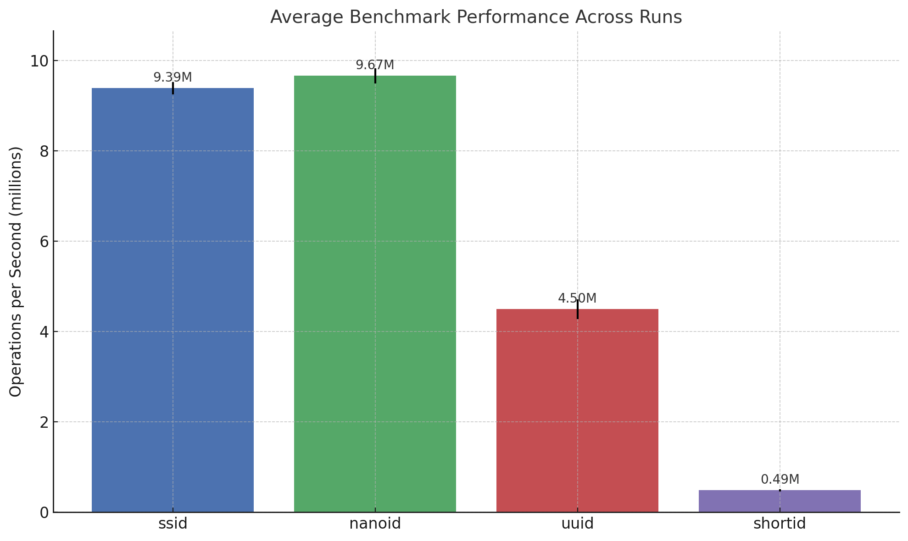

# SSID (Secure Short ID) Generator [](https://www.npmjs.org/package/ssid)

SSID Generator is a Node.js module that provides a secure and efficient way to generate short IDs, suitable for various use cases such as unique identifiers in databases, session IDs, URL shorteners, etc.

## Features

- Generates short IDs using a secure algorithm.
- Customizable length for generated IDs.
- Supports a wide range of characters, making IDs URL-friendly.
- Ensures uniqueness of generated IDs, even in high-demand scenarios.
- Suitable for applications where security and uniqueness are critical.
- Optionally includes or excludes symbols based on your requirements.
- **Generate short IDs with prefix and suffix**

## Benchmark



## Installation

You can install the Secure Short ID Generator module via npm:

```bash
npm install ssid
```

## Usage

```javascript
const { ssid, ssidWithAffixes } = require("ssid");

// Generate a short ID with default length (8 characters)
const shortId = ssid();
console.log("Short ID", shortId);

// Generate a short ID with default length (8 characters) without symbols
const customAlphabet = "abcdefghijklmnopqrstuvwxyz1234567890";
const shortId = ssid(8, customAlphabet);
console.log("Short ID:", shortId);

// Generate a short ID with default length (8 characters)
const shortId = ssidWithAffixes(11, "ssid-");
console.log("Short ID", shortId);

// Generate a short ID with default length (8 characters) without symbols
const customAlphabet = "abcdefghijklmnopqrstuvwxyz1234567890";
const shortId = ssidWithAffixes(8, "2025", "", customAlphabet);
console.log("Short ID:", shortId);
```

## Parameters

### `ssid(length = DEFAULT_LENGTH, customAlphabet = DEFAULT_ALPHABET)`

| Parameter       | Type     | Default                  | Description                                                                 |
|-----------------|----------|--------------------------|-----------------------------------------------------------------------------|
| `length`        | Number   | `DEFAULT_LENGTH` (8)     | The length of the generated ID.                                             |
| `customAlphabet`| String   | `DEFAULT_ALPHABET`       | A custom set of characters to use for generating the ID.                    |

### `ssidWithAffixes(length = DEFAULT_LENGTH, prefix, suffix, customAlphabet = DEFAULT_ALPHABET)`

| Parameter       | Type     | Default                  | Description                                                                 |
|-----------------|----------|--------------------------|-----------------------------------------------------------------------------|
| `length`        | Number   | `DEFAULT_LENGTH` (8)     | The length of the generated ID (prefix+suffix)                                             |
| `prefix`        | String   |                          | A string to prepend to the generated ID. Either prefix or suffix must be provided. |
| `suffix`        | String   |                          | A string to append to the generated ID. Either prefix or suffix must be provided.  |
| `customAlphabet`| String   | `DEFAULT_ALPHABET`       | A custom set of characters to use for generating the ID.                    |

## License

This project is licensed under the [MIT License](LICENSE).
